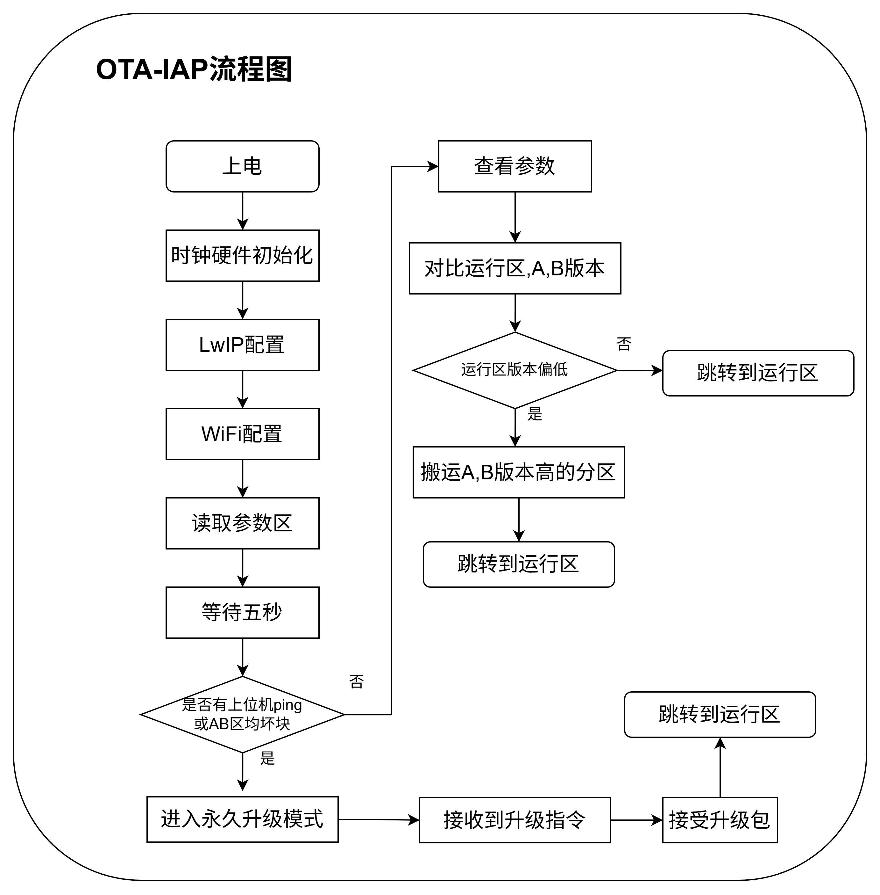
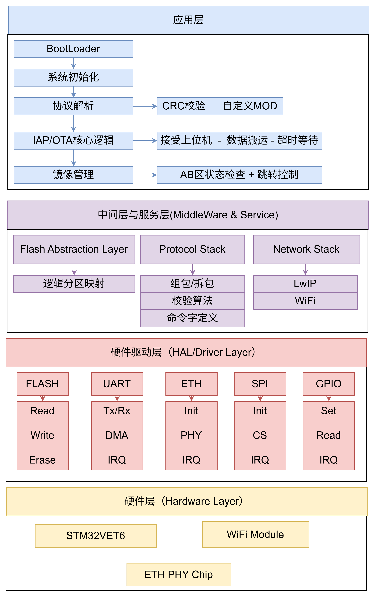
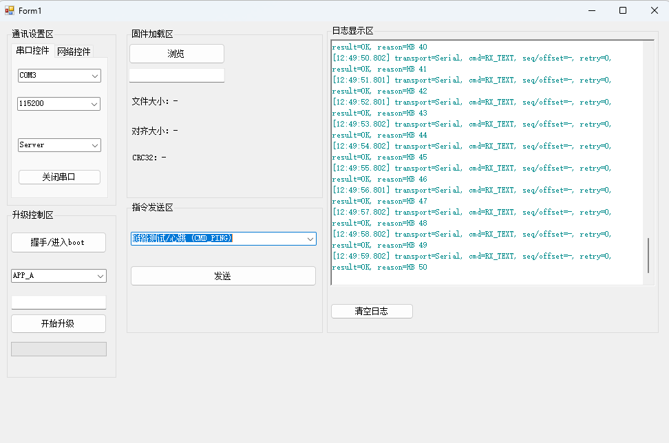

# Embedded Multi-Channel IAP/OTA Firmware Upgrade System (STM32)
Second-stage, industrial-grade firmware update system with A/B redundancy and UART/Ethernet/Wi‑Fi update paths, designed for unattended IoT endpoints.

<a id="language-selector"></a>

**Language / 语言**
- [English](#english)
- [中文](#中文)

---

<a id="english"></a>

## English

### Table of Contents
- [1. Background & Motivation](#1-background--motivation)
- [2. Key Features](#2-key-features)
- [3. Tech Stack & Tooling](#3-tech-stack--tooling)
- [4. System Architecture](#4-system-architecture)
- [5. Key Technical Highlights](#5-key-technical-highlights)
- [6. Results & Verification](#6-results--verification)
- [7. Future Work](#7-future-work)
- [8. Reproducibility: Build & Run](#8-reproducibility-build--run)
- [Keywords / Tags](#keywords--tags)

---

## 1. Background & Motivation
Unattended industrial IoT devices must be upgradeable over years without physical access. In practice, firmware updates fail for reasons that are normal in the field:

- Unstable links (TCP resets, UART noise, Wi‑Fi dropouts)
- Power loss during flashing
- Partial images / corrupted payloads
- Version management and rollback requirements

This project implements a second-stage bootloader for STM32-class MCUs, enabling reliable remote firmware updates through:

- A/B redundant storage to prevent bricking
- A unified Run execution region with post-copy verification
- Multiple update transports (UART custom protocol, Ethernet TCP via LwIP RAW API, Wi‑Fi module transparent link)

---

## 2. Key Features
- A/B dual-image redundancy: download into `App_A` or `App_B`, validate, then promote to `Run`.
- Multi-channel update:
  - UART: custom framed protocol with CRC16
  - Ethernet: LwIP + TCP server (RAW API, bare-metal friendly)
  - Wi‑Fi module: ESP8266-style UART transparent transmission (transport abstraction allows replacement by SPI/Wi‑Fi designs)
- Second-stage boot architecture: bootloader (bare-metal) + application layer (RTOS-ready).
- Update session control: transport-based session lock (`CMD_BUSY`) to prevent concurrent updates.
- Safety gates before jump: vector table sanity check + CRC32 verification.

---

## 3. Tech Stack & Tooling

| Category | Choice in this repo | Notes |
|---|---|---|
| MCU | STM32F407 (Cortex‑M4) | Portable to similar STM32 / Cortex‑M MCUs |
| HAL/SDK | STM32 HAL + CMSIS | CubeMX-style project layout |
| Network stack | LwIP (RAW API) | Stable and low overhead for bare-metal |
| Ethernet transport | TCP server | Single-client strategy to avoid resource exhaustion |
| Wi‑Fi transport | ESP8266 AT + UART transparent mode | Practical OTA transport for rapid validation |
| Host interface | Any TCP client / serial tool | Easy to extend via Python/C#/etc. |
| Debugging | ST‑Link, Keil uVision, UART logs | Logging can be muted during update |

Security note: This repository contains example Wi‑Fi SSID/password macros in code for lab usage. Do not hardcode secrets in production; use secure provisioning instead.

---

## 4. System Architecture

### 4.1 Flash Partitioning
The system uses five functional regions (plus reserved space) to separate concerns and enable rollback.

| Region | Address Range | Purpose |
|---|---:|---|
| Boot | `0x0800_0000` – `0x0800_FFFF` | Bootloader image |
| Param | `0x0801_0000` – `0x0801_FFFF` | Persistent metadata: version/status/CRC/selection |
| Run | `0x0802_0000` – `0x0805_FFFF` | The only executable application region (final jump target) |
| App_A | `0x0806_0000` – `0x0809_FFFF` | Image staging slot A |
| App_B | `0x080A_0000` – `0x080D_FFFF` | Image staging slot B |

Reference: [flash_manage.h](file:///d:/01_Embedded/01_Project/Ota_Iap_Remote_Upgrade_260301/IAP_OTA_Remote_Upgrade/Core/Inc/flash_manage.h)

Why a dedicated Run region?
- It enforces a single boot entry (vector table at Run).
- It simplifies A/B switching and reduces the risk of jumping into partially-written images.

### 4.2 Boot Flow
<p align="center">
  
</p>

Implementation reference: [main.c](file:///d:/01_Embedded/01_Project/Ota_Iap_Remote_Upgrade_260301/IAP_OTA_Remote_Upgrade/Core/Src/main.c)

### 4.3 Multi-Channel Update Logic
All transports feed the same byte-stream protocol parser and then dispatch to command handlers:

- UART ISR → byte parser → frame unpack → handler
- Ethernet TCP recv callback → byte parser → frame unpack → handler
- Wi‑Fi transparent UART → byte parser → frame unpack → handler

Reference: [protocol.c](file:///d:/01_Embedded/01_Project/Ota_Iap_Remote_Upgrade_260301/IAP_OTA_Remote_Upgrade/Core/Src/protocol.c), [protocol_handler.c](file:///d:/01_Embedded/01_Project/Ota_Iap_Remote_Upgrade_260301/IAP_OTA_Remote_Upgrade/Core/Src/protocol_handler.c)

<p align="center">
  
</p>

---

## 5. Key Technical Highlights

### 5.1 A/B Redundancy + Promotion-to-Run
Design intent: avoid half-flashed runnable images.

- Download into `App_A` or `App_B` (non-executable staging)
- Verify integrity (CRC32)
- Promote by copying into `Run` and validating again before jump
- Persist metadata in `Param` (version, size, crc32, status, boot_select)

### 5.2 Custom UART-Like Frame Protocol
Design intent: survive noisy links and simplify host tooling.

Frame format (little-endian):

```text
| Header(0xAA55) | CMD(16) | LEN(16) | DATA(LEN) | RESERVED(32) | CRC16(16) |
```

Reference: [protocol.h](file:///d:/01_Embedded/01_Project/Ota_Iap_Remote_Upgrade_260301/IAP_OTA_Remote_Upgrade/Core/Inc/protocol.h)

Notes:
- CRC16 ensures transport integrity (frame-level).
- CRC32 (HW CRC) ensures image integrity (firmware-level).

### 5.3 Update Session Safety & Fault Tolerance
Design intent: make failures recoverable and observable.

- Session lock: if an update is active and another transport tries to start, respond `CMD_BUSY`.
- Strict bounds checks: alignment, max size, non-zero length, total received equals expected.
- Persistent state: `APP_STATUS_UPDATING/VALID/INVALID` in Param region.
- Rollback: CRC mismatch marks target invalid; last known good image remains available.

---

## 6. Results & Verification
Validation philosophy: test failure modes, not only the happy path.

| Test Item | UART | Ethernet (LwIP+TCP) | Wi‑Fi (UART transparent) |
|---|---:|---:|---:|
| Full image upgrade | ✅ | ✅ | ✅ |
| CRC mismatch rejection | ✅ | ✅ | ✅ |
| Interrupt transfer (drop connection) | ✅ | ✅ | ✅ |
| Reboot recovery after failed update | ✅ | ✅ | ✅ |
| A/B fallback (keep last known good) | ✅ | ✅ | ✅ |

---

## 7. Future Work
Planned improvements aligned with production-grade and research-grade firmware update systems:

- Secure boot & signed updates (RSA/ECDSA signature verification)
- Encrypted transport & storage (TLS on transport; AES at-rest)
- Delta / differential updates to reduce bandwidth and downtime
- Wear leveling / metadata journaling for flash longevity
- Power-fail safe promotion (two-phase commit for Run)
- Low-power update scheduling for battery-powered endpoints

---

## 8. Reproducibility: Build & Run

### 8.1 Build
1. Open the Keil project: `IAP_OTA_Remote_Upgrade/MDK-ARM/IAP_OTA_Remote_Upgrade.uvprojx`
2. Select target and build (`F7`).
3. Flash to the MCU using ST‑Link.

### 8.2 Configure transports
- Ethernet TCP server port: default `5000` (see boot init).
- Wi‑Fi module: configure SSID/password/remote TCP endpoint in:  
  [wifi_at.h](file:///d:/01_Embedded/01_Project/Ota_Iap_Remote_Upgrade_260301/IAP_OTA_Remote_Upgrade/Core/Inc/wifi_at.h)

### 8.3 Upgrade procedure (high-level)
1. Connect via one transport (UART / Ethernet / Wi‑Fi).
2. Send:
   - `CMD_UPDATE_START` (target A/B, version, size, crc32)
   - `CMD_UPDATE_DATA` chunks (aligned, bounded)
   - `CMD_UPDATE_END` (device verifies CRC32 and marks image valid)
3. Reboot (e.g., `CMD_RESET`) to let the bootloader promote A/B → Run and jump.

### 8.4 Host Tool (Screenshot)
<p align="center">
  
</p>

---

## Keywords / Tags
Embedded Systems, IAP/OTA, Firmware Update, STM32, FreeRTOS, LwIP, Industrial IoT

[Back to Language Selector](#language-selector)

---

<a id="中文"></a>

## 中文

### 目录
- [1. 项目背景与动机](#1-项目背景与动机)
- [2. 核心特性](#2-核心特性)
- [3. 技术栈与开发环境](#3-技术栈与开发环境)
- [4. 系统架构设计](#4-系统架构设计)
- [5. 关键技术实现亮点](#5-关键技术实现亮点)
- [6. 项目成果与验证](#6-项目成果与验证)
- [7. 未来优化方向](#7-未来优化方向)
- [8. 如何复现与运行](#8-如何复现与运行)
- [关键词标签](#关键词标签)

---

## 1. 项目背景与动机
工业物联网终端往往处于长期无人值守环境，固件升级是“必须具备”的能力，但现场失败模式非常常见：

- 链路不稳定（TCP 断开、串口噪声、Wi‑Fi 掉线）
- 升级过程中断电
- 固件分片缺失或数据损坏
- 需要可追溯的版本管理与可控回滚

本项目实现一个面向 STM32 等 MCU 的二级引导式 IAP/OTA 升级系统，通过系统化的分区与状态机设计，实现可恢复、可验证的远程升级能力：

- A/B 双分区冗余备份，避免升级失败导致变砖
- 统一 Run 运行区，复制后再次校验再跳转
- 多通道升级（UART 自定义协议、以太网 TCP、Wi‑Fi 模组透传）

---

## 2. 核心特性
- A/B 双镜像冗余：固件先下载到 `App_A` / `App_B`，校验通过后再“晋升”到 `Run` 运行区。
- 多通道升级：
  - UART：自定义帧协议，CRC16 校验
  - 以太网：LwIP + TCP Server（RAW API，适配裸机）
  - Wi‑Fi：ESP8266 AT + 串口透传（通道层可替换为 SPI/Wi‑Fi 方案）
- 二级引导架构：Bootloader 裸机 + 应用层（可扩展为 RTOS 应用）。
- 会话互斥：升级期间跨通道加锁，返回 `CMD_BUSY` 防止并发写 Flash。
- 跳转前安全闸门：向量表合法性检查 + CRC32 校验，确保运行镜像可信。

---

## 3. 技术栈与开发环境

| 类别 | 本仓库选择 | 说明 |
|---|---|---|
| MCU | STM32F407（Cortex‑M4） | 可移植到同类 STM32 / Cortex‑M |
| SDK | STM32 HAL + CMSIS | CubeMX 风格工程结构 |
| 网络协议栈 | LwIP（RAW API） | 裸机环境稳定、资源占用低 |
| 以太网通道 | TCP Server | 单连接策略，降低资源风险 |
| Wi‑Fi 通道 | ESP8266 AT + UART 透传 | 便于快速搭建 OTA 验证链路 |
| 上位机工具 | 任意 TCP Client / 串口工具 | 可用 Python/C# 扩展自动化 |
| 调试工具 | ST‑Link、Keil、串口日志 | 升级期间可按需关闭日志 |

安全说明：仓库代码中可能包含实验室 Wi‑Fi 的宏配置示例，不建议在量产产品中硬编码敏感信息，应使用安全配网/安全存储方案。

---

## 4. 系统架构设计

### 4.1 Flash 分区设计
系统采用五个功能分区（另含预留区）实现职责隔离与回滚能力。

| 分区 | 地址范围 | 用途 |
|---|---:|---|
| Boot | `0x0800_0000` – `0x0800_FFFF` | Bootloader 本体 |
| Param | `0x0801_0000` – `0x0801_FFFF` | 参数/标志：版本、状态、CRC、选择位 |
| Run | `0x0802_0000` – `0x0805_FFFF` | 运行区：唯一跳转执行入口 |
| App_A | `0x0806_0000` – `0x0809_FFFF` | A 镜像暂存区 |
| App_B | `0x080A_0000` – `0x080D_FFFF` | B 镜像暂存区 |

参考实现：[flash_manage.h](file:///d:/01_Embedded/01_Project/Ota_Iap_Remote_Upgrade_260301/IAP_OTA_Remote_Upgrade/Core/Inc/flash_manage.h)

为什么引入 Run 运行区？
- 固定唯一启动入口（向量表始终在 Run）。
- A/B 只作为暂存与验证区，降低直接跳转到“半写入镜像”的风险。
- 简化引导流程与状态维护。

### 4.2 二级引导流程
<p align="center">
  
</p>

参考实现：[main.c](file:///d:/01_Embedded/01_Project/Ota_Iap_Remote_Upgrade_260301/IAP_OTA_Remote_Upgrade/Core/Src/main.c)

### 4.3 多通道升级逻辑
三种通道最终都汇聚到同一套“字节流协议解析 + 命令分发”：

- UART 中断 → 字节解析 → 解包 → 命令处理
- TCP 接收回调 → 字节解析 → 解包 → 命令处理
- Wi‑Fi 透传串口 → 字节解析 → 解包 → 命令处理

参考实现：[protocol.c](file:///d:/01_Embedded/01_Project/Ota_Iap_Remote_Upgrade_260301/IAP_OTA_Remote_Upgrade/Core/Src/protocol.c)、[protocol_handler.c](file:///d:/01_Embedded/01_Project/Ota_Iap_Remote_Upgrade_260301/IAP_OTA_Remote_Upgrade/Core/Src/protocol_handler.c)

<p align="center">
  
</p>

---

## 5. 关键技术实现亮点

### 5.1 A/B 冗余 + 复制到 Run
设计目的：避免“可执行镜像半写入”导致不可恢复故障。

- 固件先写入 A/B 暂存区
- 通过 CRC32 做镜像级校验
- 校验通过后复制到 Run，并在跳转前再次验证
- 元数据落盘到 Param（version/size/crc/status/boot_select）

### 5.2 自定义串口协议（参考 Modbus 思路）
设计目的：在噪声串口与粘包场景下，保证可解析、可校验、易扩展。

协议帧（小端序）：

```text
| 帧头(0xAA55) | 命令(16) | 长度(16) | 数据(N) | 保留位(32) | CRC16(16) |
```

参考实现：[protocol.h](file:///d:/01_Embedded/01_Project/Ota_Iap_Remote_Upgrade_260301/IAP_OTA_Remote_Upgrade/Core/Inc/protocol.h)

说明：
- CRC16 用于帧级传输校验。
- CRC32 用于固件镜像完整性校验（更接近工业升级的“两层校验”做法）。

### 5.3 升级容错与互斥机制
设计目的：让失败可恢复、过程可控、状态可追溯。

- 会话互斥：升级进行中，其他通道发起升级返回 `CMD_BUSY`。
- 边界校验：对齐、长度、累计接收量、分区边界严格校验。
- 持久化状态：Param 中维护 `UPDATING/VALID/INVALID`。
- 回滚：CRC 不匹配则标记目标区无效，保留上一份可用镜像。

---

## 6. 项目成果与验证
验证理念：不仅验证“成功升级”，更验证断链、错包、断电重启等现场失败模式。

| 测试项 | UART | 以太网（LwIP+TCP） | Wi‑Fi（串口透传） |
|---|---:|---:|---:|
| 完整镜像升级 | ✅ | ✅ | ✅ |
| CRC 不匹配拒绝 | ✅ | ✅ | ✅ |
| 传输中断（断链） | ✅ | ✅ | ✅ |
| 失败升级后重启恢复 | ✅ | ✅ | ✅ |
| A/B 回退（保留最后可用版本） | ✅ | ✅ | ✅ |

---

## 7. 未来优化方向
体现持续改进与学术潜力的方向：

- 安全启动与签名升级（RSA/ECDSA）
- 传输与存储加密（TLS/AES）
- 差分升级（降低带宽与停机时间）
- Flash 寿命优化（磨损均衡、元数据日志化）
- 复制到 Run 的两阶段提交（更强断电保护）
- 低功耗设备的升级调度策略

---

## 8. 如何复现与运行

### 8.1 编译
1. 打开 Keil 工程：`IAP_OTA_Remote_Upgrade/MDK-ARM/IAP_OTA_Remote_Upgrade.uvprojx`
2. 选择目标并编译（`F7`）
3. 使用 ST‑Link 下载到 MCU

### 8.2 通道配置
- 以太网 TCP Server 默认端口：`5000`（见 boot 初始化逻辑）
- Wi‑Fi 模组参数（SSID/密码/TCP 目标）：  
  [wifi_at.h](file:///d:/01_Embedded/01_Project/Ota_Iap_Remote_Upgrade_260301/IAP_OTA_Remote_Upgrade/Core/Inc/wifi_at.h)

### 8.3 升级流程（概览）
1. 选择一种通道接入（UART / 以太网 / Wi‑Fi）
2. 发送：
   - `CMD_UPDATE_START`（目标 A/B、版本、大小、CRC32）
   - `CMD_UPDATE_DATA`（分片数据，要求对齐与边界合法）
   - `CMD_UPDATE_END`（设备计算 CRC32，标记镜像有效）
3. 重启（如 `CMD_RESET`），Bootloader 执行 A/B → Run 的复制与校验后跳转

### 8.4 上位机工具（界面概览）
<p align="center">
  
</p>

---

## 关键词标签
Embedded Systems, IAP/OTA, Firmware Update, STM32, FreeRTOS, LwIP, Industrial IoT

[返回语言选择](#language-selector)
